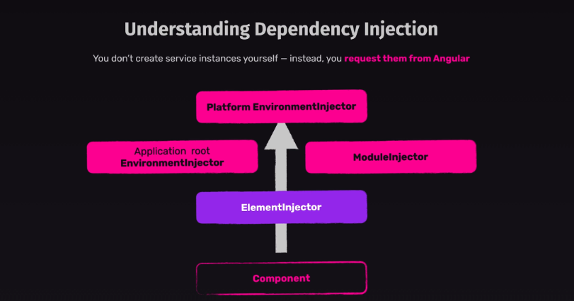

Angular has a hierarchical dependency injection system. This means, Angular has not only one injector. It creates a hierarchical tree of Injectors.

Angular has the following injector hierarchies:

    1. 'EnvironmentInjector' hierarchy
    2. 'ModuleInjector' hierarchy
    3. 'ElementInjector' hierarchy 

## 'EnvironmentInjector' HIERARCHY

The 'EnvironmentInjector' can be configured in one of two ways by using:

 - The '@Injectable()' 'providedIn' property to refer to 'root' or 'platform'.
 - The 'ApplicationConfig' 'providers' array.
  
Using the '@Injectable() providedIn' property is preferable to using the 'ApplicationConfig' 'providers' array. 

With '@Injectable() providedIn', optimization tools can perform tree-shaking, which removes services that your application isn't using. This results in smaller bundle sizes.

So, when we write - 

    providedIn: 'root'

The 'providedIn' property configures a specific 'EnvironmentInjector', here 'root', which makes the service available in the root EnvironmentInjector.

There are two more injectors above 'root', an additional 'EnvironmentInjector' and 'NullInjector()'.

## 'ModuleInjector' HIERARCHY

In the case of 'NgModule' based applications, the 'ModuleInjector' can be configured in one of two ways by using:

 - The '@Injectable() providedIn' property to refer to root or platform.
 - The '@NgModule()' providers array.

It is important to note that if you have "Eagerly" loaded modules in your NgModule-based application and you put any service in the providers array of that NgModule, that will have the same effect as providing the service to the Root Module (AppModule). So, generally, it is recommended that you provide the services in the providers of Root Module if you intend them to be available in the entire application.

But, the story is different in case of "Lazy" loaded modules. If you put any service in the providers array of that Lazy Loaded NgModule, that will create a new instance of that service specifically for that Lazy Loaded Module and its components, directives etc. You should be very careful while adding services to the providers array of a Lazy Loaded module. If you don't intend to have a separate instance of that service for that Module, don't do it otherwise you will have to deal with weird issues.

## 'ElementInjector' HIERARCHY

Angular creates 'ElementInjector' hierarchies implicitly for each DOM element.

So, when we use the "providers" array of @Component() decorator or the "viewProviders" property, then this configures an "ElementInjector".

For example, the following 'TestComponent' configures the 'ElementInjector' by providing the service as follows:

    @Component({
        …
        providers: [{ provide: ItemService, useValue: { name: 'lamp' } }]
    })
    export class TestComponent...

When you provide services in a component, that service is available by way of the 'ElementInjector' at that component instance. When the component instance is destroyed, so is that service instance.

A component is a special type of directive, which means that just as '@Directive()' has a providers property, '@Component()' does too. 

This means that directives as well as components can configure providers, using the providers property. When you configure a provider for a component or directive using the providers property, that provider belongs to the ElementInjector of that component or directive. Components and directives on the same element share an injector.

# RESOLUTION RULES

So, when a component asks for a dependency, how does Angular resolves that dependency? How does Angular know from where to get the dependency?

When a component declares a dependency, Angular tries to satisfy that dependency with that component's own 'ElementInjector'. If the component's injector lacks the provider, it passes the request up to its parent component's 'ElementInjector'.

The requests keep forwarding up until Angular finds an injector that can handle the request or runs out of ancestor 'ElementInjector' hierarchies.

If Angular doesn't find the provider in any 'ElementInjector' hierarchies, it goes back to the element where the request originated and looks in the 'EnvironmentInjector' hierarchy. If Angular still doesn't find the provider, it throws an error (Unless you have told Angular whether to throw an error or not).

If you have registered a provider for the same DI token at different levels, the first one Angular encounters is the one it uses to resolve the dependency. If, for example, a provider is registered locally in the component that needs a service, Angular doesn't look for another provider of the same service.

For 'NgModule' based applications, Angular will search the 'ModuleInjector' hierarchy if it cannot find a provider in the 'ElementInjector' hierarchies.

# RESOLUTION MODIFIERS

Angular's resolution behavior can be modified with @Optional(), @Self(), @SkipSelf() and @Host(). 

Import each of them from @angular/core and use each in the component class constructor or in the inject configuration when you inject your service.

Resolution modifiers fall into three categories:

    What to do if Angular doesn't find what you're looking for, that is @Optional()
    Where to start looking, that is @SkipSelf()
    Where to stop looking, @Host() and @Self()

By default, Angular always starts at the current 'Injector' and keeps searching all the way up. Modifiers allow you to change the starting, or self, location and the ending location.

You can read about these in detail on the official Angular documentation -> https://angular.dev/guide/di/hierarchical-dependency-injection#resolution-modifiers