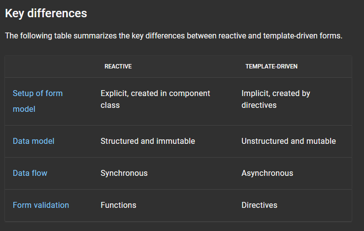

In Angular, there are two different approaches to handle the user inputs through forms.

1. Reactive Forms
2. Template-Driven Forms

The basic functionality is the same in both. That is, both capture user input events from the view, validate the user input, create a form model and data model to update, and provide a way to track changes.

But, for certain use cases, the Reactive Forms are preferred, whereas for others, the Template-Driven Forms are preferred.

## TEMPLATE-DRIVEN FORMS

The name says it all. These types of forms in Angular have the main logic in the HTML Template itself. So, we use directives in the template tp create and manipulate the underlying object model.
Angular automatically infers the structure of the form from the DOM.

These type of forms are useful in adding some simple forms to an app like maybe an email list signup form or login form etc. They're straightforward to add to an app but, when it comes to scaling them, that's not very intiuitive. The templaet can become quite complicated and messy as we keep adding new form controls in template driven forms.

But, If you have very basic form requirements and logic that can be managed solely in the template, template-driven forms could be a good fit.

## REACTIVE FORMS

In the Reactive Form, instead of letting Angular infer the structure of the form, we programmatically define it in the component file. And then, all we do is sync the form modal that we created with the actual form in the HTML file.

So, most of the logic remains in the .ts file so the template does not look messy.

While initially the reactive forms look more complicated, they are more scalable, reusable and testable.

If forms are a key part of your application, or you're already using reactive patterns for building your application, use reactive forms.

