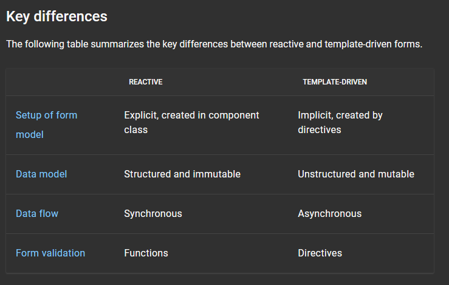

In Angular, there are three different approaches to handle the user inputs through forms.

    1. Reactive Forms
    2. Template-Driven Forms
    3. Signal Forms

The basic functionality is the same in all. That is, all of these capture user input events from the view, validate the user input, create a form model and data model to update, and provide a way to track changes.

## TEMPLATE-DRIVEN FORMS

The name says it all. These types of forms in Angular have the main logic in the HTML Template itself. So, we use directives in the template to create and manipulate the underlying object model.
Angular automatically infers the structure of the form from the DOM.

These type of forms are useful in adding some simple forms to an app like maybe an email list signup form or login form etc. They're straightforward to add to an app but, when it comes to scaling them, that's not very intiuitive. The template can become quite complicated and messy as we keep adding new form controls in template driven forms.

But, If you have very basic form requirements and logic that can be managed solely in the template, template-driven forms could be a good fit.

## REACTIVE FORMS

In the Reactive Form, instead of letting Angular infer the structure of the form, we programmatically define it in the component file. And then, all we do is sync the form modal that we created with the actual form in the HTML file.

So, most of the logic remains in the .ts file so the template does not look messy.

While initially the reactive forms look more complicated, they are more scalable, reusable and testable.

If forms are a key part of your application, or you're already using reactive patterns for building your application, use reactive forms.

## SIGNAL FORMS

With Angular 21, a new way to handle forms was introduced, called 'Signal Forms'. This approach leverages the signals to manage form state and validation in a more reactive and efficient manner. Signal Forms allow developers to create forms that automatically update and react to changes in the form state, making it easier to handle complex form interactions and validations.

# WHICH APPROACH TO USE?

As per Angular's official documentation -

    Use Signal Forms if:

    1. You're building new signal-based applications (Angular v21+)
    2. You want type safety inferred from your model structure
    3. You're comfortable working with experimental features
    4. Schema-based validation appeals to you
    5. Your team is familiar with signals

    Use Reactive Forms if:

    1. You need production-ready stability
    2. You're building complex, dynamic forms
    3. You prefer observable-based patterns
    4. You need fine-grained control over form state
    5. You're working on an existing reactive forms codebase

    Use Template-driven Forms if:
    
    1. You're building simple forms (login, contact, search)
    2. You're doing rapid prototyping
    3. Your form logic is straightforward
    4. You prefer keeping form logic in templates
    5. You're working on an existing template-driven codebase