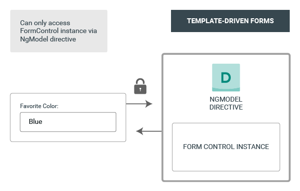
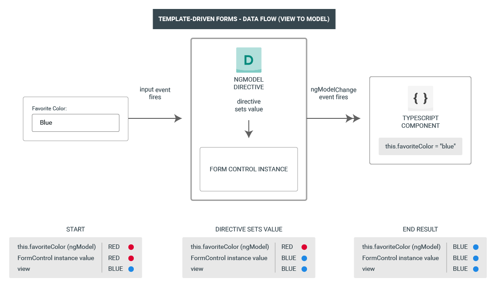
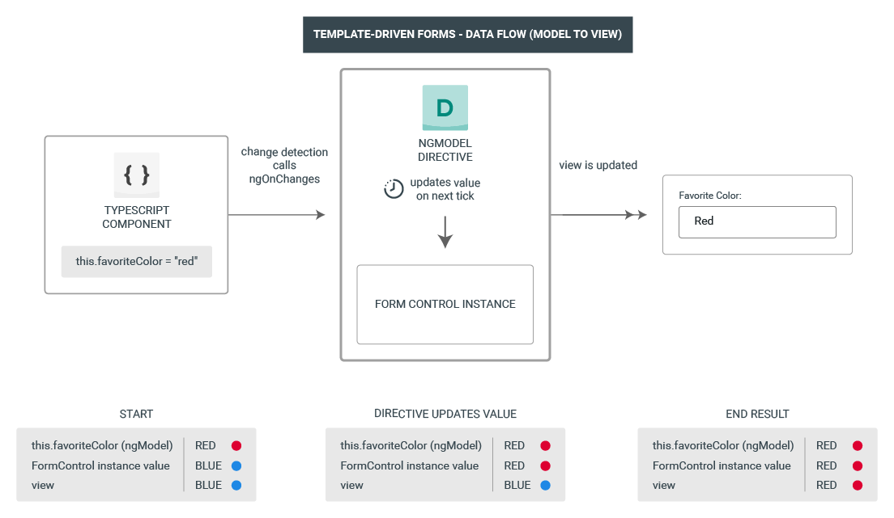

There are some important things to remember about TD Forms.

1. The Form Model is "implicit" in the Template-Driven Forms. 
2. For a given Template-Driven form, the directive "NgModel" creates and manages a "FormControl" instance for a form element.
3. The single source of truth is the template. We do not have any direct programmatic access to the "FormControl" instance. We can access only via NgModel directive.

# DATA FLOW IN TEMPLATE-DRIVEN FORMS

As we understood above, there is a directive for each TD form that manages the form model internally.

Let's take an example of an input box as shown in above image. 

Suppose the default value of this input is "Red". 

Here's what happens when value is changed in the View  -

1. There is an input box for the "Favorite Color".
2. When a user inputs some text in this input box, an input event gets fired as the input field emits this "input" event with the value as "Blue".

----------------------------------------------------------------
So far, as we can see in image above, only the UI or the "View" has the latest data which is "Blue". The Form Control Instance and also the "this.favouriteColor" variable in the .ts file both have value as "Red" at this point.
----------------------------------------------------------------

3. Now, the value is set for that FormControl instance and again,this setting of value happens through the "NgModel" directive on the form.

----------------------------------------------------------------
At this point, the Form Control Instance now has the latest value as well, that is "Blue". But, the property in the component still has "Red".
----------------------------------------------------------------

4. Once the value of Form Control Instance changes, it emits this new value using the "valueChanges" observable and any subscribers to the "valueChanges" observable receive the new value.
   
5. The ngModelChange event is also fired and since two-way data binding is being used in the form, the "this.favoriteColor" is now updated to "Blue".

A Similar thing happens when the data is changed in the component. For example, if the this.favouriteColor is set to "Red" in the component then let's see how this data flow from Model to View happens.

1. The favoriteColor value is updated in the component.
2. Change detection begins.
3. During change detection, the ngOnChanges lifecycle hook is called on the NgModel directive instance because the value of one of its inputs has changed.
4. The ngOnChanges() method queues an async task to set the value for the internal FormControl instance.
5. Change detection completes.
6. On the next tick, the task to set the FormControl instance value is executed.
7. The FormControl instance emits the latest value through the valueChanges observable.
8. Any subscribers to the valueChanges observable receive the new value.
9. The control value accessor updates the form input element in the view with the latest favoriteColor value.
