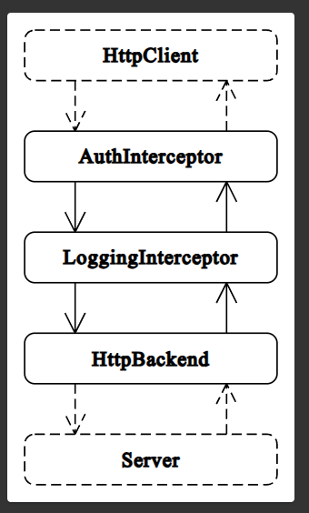

Using Interceptors, we cannot just intercept the outgoing request. In fact, we can also intercept the incoming response.

And that we can do on the "next.handle()" method because in the end, this method will return an Observable. And since it will return an observable, it means, this observable will give us the response in the future after the request is sent and server sends back the response.

In fact, take look at this picture - 

This picture shows the order in which Interceptors are called. 

They are called in the same order in which you provide them.

So, in above picture, we have two Interceptors -> "AuthInterceptor" and "LoggingInterceptor". And if we have provided "AuthInterceptor" before the "LoggingInterceptor", then the former will be called before the latter.

So, the outgoing request goes into the "AuthInterceptor" first, then into the "LoggingInterceptor". And similarly, the incoming response comes into the "LoggingInterceptor" first and then to the "AuthInterceptor".

It is important to note that "HttpBackend" is always the last interceptor that handles the communication with the server.

This means, if we have no Interceptors created of our own, even then, the "HttpBackend" interceptor is being used under the hood by Angular.

So, now, let's come back to our project.

When we make a request, our "Auth Interceptor" will intercept that and add the headers and then just forwards it to the "HttpBackend" interceptor.

Similarly, when we get a response, the "HttpBacked" interceptor will take it and forward it to our "Auth Interceptor" before it reaches the "HttpClient".

So that's why, we can subscribe to the "next.handle()" inside the "Auth Interceptor" so that the response that it gets can then be accessed at that point before it is passed on to "HttpClient".

    return next.handle(modifiedRequest).pipe(tap(event => {
        if(event.type === HttpEventType.Response) {
            console.log("Response arrived")
            console.log("Body is", event.body);
        }
    }));

One thing to note is that in the Interceptor, we always get the "event", not the "response" or "body". So, we get what we got when we used "observe" property and set it to "events" in HTTPClient's 
request methods.

This is just so that you have a fine control over the response.

So now, this is quite helpful because before the response is sent to the HttpClient, we can transform it to maybe some particular format.