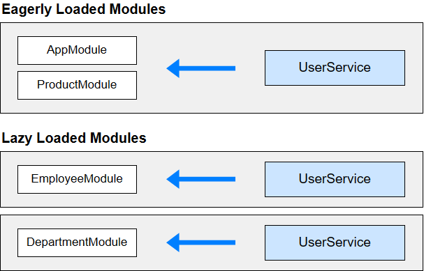

So far, while we have done a lot in this section like splitting our application into different modules, lazy loading the modules, pre-loading the modules and so on, there is one thing that we haven't discussed yet.

How are Angular Services work with different modules? We know that for "Components" or "Directives" or "Pipes", we can simply add them to a Shared Module and then export them from that module so that they can then be used in any other module.

But, what about Services?

Let's first recall what we already know about "Providing" Services.
As we know, "Providers" in Angular are used to "configure" services and make them available to the components in the application. 

When we do something like this in AppModule file - 

    provide : [ABCService]

Then, all that we are telling Angular is that use "ABCService" class to get an instance of "ABCService" whenever it is required in any component. 

Now, the thing with Services is that, they can be provided in various ways in various places and each way has its own use cases.

# WAYS TO PROVIDE SERVICES

## 1. IN ROOT MODULE (OR BY USING {providedIn:root})

The most common way to Provide services is to do it in the "App Module" by adding them to the "providers" array. What this does is that the Service will now be available application-wide.

It is important to note that when we do this, it means the "same instance" of that service is available to the whole application.

    e.g. if we do providers: [DataStorageService] in AppModule

Then, this service is now globally available to the whole application, no matter which module this is.

In new Angular versions, when you generate a new Service, instead of adding it to the AppModule's providers array, Angular instead usses @Injectable decorator like this -

    @Injectable({providedIn: 'root'})
    export class DataStorageService{}

This has the same meaning as providing this Service in the "providers" array of the App Module. 

## 2. IN A COMPONENT

It is also possible to provide a Service at a component level. 

For example, if we have two components say "ABCComponent" and "EFGComponent" and there is some service "XYZService" that only the "ABCComponent" will use, then we can just provide it in the "ABCComponent" only.

We do that using the "providers" property of the @Component decorator. For example - 

    @Component({
        providers: [DataStorageService]
    })
    export class ABCComponent{}

For eg. consider two component “ShoppingListComponent” and “ContactListComponent”, each having child component as "listItems", "checkoutWindow" and "addressBook" respectively. 

In such case providing service at component level, that is in the “shoppingListComponent” and “ContactListComponent” separately, will create an instance of the same service for “shoppingListComponent” and its child( listItems, checkoutWindow) and a separate instance of the same service for “contactListComponent” and its child(addressBook).

## 3. IN AN EAGER LOADED MODULE

Eagerly loaded modules are the ones that are not lazy loaded and are downloaded in the initial application bundle when the application is loaded. 

So, what happens if we Provide a service in the "providers" array of a feature module that is not lazy loaded?

For example, let's say our "RecipesModule" is an Eagerly Loaded module. That is, it is not lazy loaded.

Then, if in its providers array we provide some service, then would that service be limited to this module only?

Well, NO!

Providing service in a eagerly loaded module will give the same instance of service application wide, that is same as providing in App Module.

So, it means, there is no difference between providing a service in an Eagerly Loaded module and doing the same in App Module. In both cases, the same instance of the Service will be available to the whole application.

Let's say our "RecipesModule" is eagerly-loaded and in its "providers" array we have something like this -

    providers: [DataStorageService]

Similarly, "ShoppingListModule" is also eagerly-loaded and in its "providers" array, we have the same thing as - 

    providers: [DataStorageService]

Now, even though we have provided this Service in two separate modules, what actually happens is that both of them receive the same instance of this service. There aren't two different instances just because we provided this service in two different modules.

This should be avoided although it provides same instance application wide because it might be confusing for other developers looking into your code, to determine whether the service instance is supposed to be same app-wide or not, as it not provided in App Module.

So, as Angular says - 

    Provide services that the whole application needs in the root module.

## 4. IN A LAZY LOADED MODULE

So, if in an Eager Loaded Module, providing services has the same effect as in the Root Module, then what about Lazy Loaded Modules?

Let's say our "RecipesModule" is lazy-loaded and in its "providers" array we have something like this -

    providers: [DataStorageService]

Similarly, "ShoppingListModule" is also lazy-loaded and in its "providers" array, we have the same thing as - 

    providers: [DataStorageService]

So now, will the same instance be provided to both modules?

NO! 

Providing services in the lazy loaded modules will create a separate instance of the service for the components of that module. 

It should only be used if such behavior is required , otherwise providing service like this might lead to strange bugs in your application.

Now, it might not be ideal to manually provide a service in all the lazy-loaded modules so for this, Angular has a special method in new versions.

Just like "providedIn: 'root'", we also have "providedIn: 'any'".

    @Injectable({
        providedIn: 'any',
    })
        export class UserService {
    }

With providedIn: 'any', all eagerly loaded modules share the same instance of the service; however, lazy loaded modules get a different instance of that service.

Doing this means we no longer have to manually provide a Service to different lazy loaded modules.

Here is an image to understand this - 

# NOTE

Just try to use the #1 method whenever possible unless there are some specific use cases. Otherwise, you may have to deal with weird bugs in your application.

providedIn: 'root' is the easiest and most efficient way to provide services since Angular 6 because -

 - The service will be available application wide as a singleton with no need to add it to a module's providers array (like Angular <= 5).
 - If the service is only used within a lazy loaded module it will be lazy loaded with that module
 - If it is never used it will not be contained in the build (tree shaked).