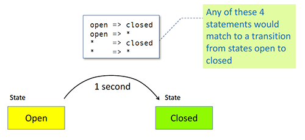

In Angular, transition states can be defined explicitly through the state() function, or using the predefined * wildcard and void states.

# WILDCARD STATE

An asterisk * or wildcard matches any animation state. This is useful for defining transitions that apply regardless of the HTML element's start or end state.

For example, when we say "open => *" it mans apply a transition when the element state changes from "open" to anything else.

When there are only two states, the wildcard is not that useful but when an element has multiple potential states that it can change to, then a wildcard is very useful.

It is also important to note that "Transitions" are matched in the same order in which they are defined.

# WILDCARDS WITH A STYLE

Use the wildcard * with a style to tell the animation to use whatever the current style value is, and animate with that. Wildcard is a fallback value that's used if the state being animated isn't declared within the trigger.

For example -

    transition ('* => open', [
        animate ('1s',
            style ({ opacity: 0.8 }),
        ),
    ]),