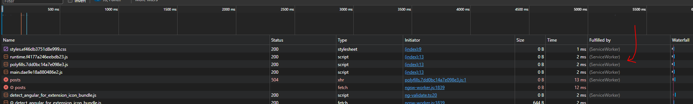

In our project, we have a simple Angular application that has an App Component and a Post component.

We are making a get request to 'https://jsonplaceholder.typicode.com/posts' to fetch some posts and then display them in the browser.

And that's pretty much it.

So, we can understand that at the moment, our application requires Internet Connectivity to work property. Because if there is no connection, then the get request cannot be successful and hence, the app will not work. We will simply see a blank page.

So, let's add a Service Worker to our project.

# ADDING A SERVICE WORKER

To set up the Angular service worker in your project, run the following CLI command:

    ng add @angular/pwa

Once this command runs, you will see some new files added to the project.

This is what the above command does - 

 - Adds the @angular/service-worker package to your project.
 - Enables service worker build support in the CLI.
 - Imports and registers the service worker with the application's root providers.
 - Updates the index.html file:
     - Includes a link to add the manifest.webmanifest file
     - Adds a meta tag for theme-color
 - Installs icon files to support the installed Progressive Web App (PWA).
 - Creates the service worker configuration file called ngsw-config.json, which specifies the caching behaviors and other settings.
  

# REGISTERING A SERVICE WORKER

If you open the app.module.ts file, you will see some new code there.

We see that a new module named "ServiceWorkerModule" has been imported -

    import { ServiceWorkerModule } from '@angular/service-worker';

And this module is then added to the imports array as - 

    imports: [BrowserModule, HttpClientModule, ServiceWorkerModule.register('ngsw-worker.js', {
        enabled: !isDevMode(),
        registrationStrategy: 'registerWhenStable:30000'
    })]

So, here, this Module is used to register a service worker and this will be that "proxy" which catches the outgoing requests and then does something with that. And as we can see, it registers a service worker by taking the name of a javascript file as the first input. Because remember that a Service worker is simply a script. 

Note that at this point, our project does not have a file named "ngsw-worker.js". That's because this is added to the dist folder when we build our project.

Then, we are passing some extra options using the second argument which is an object.

Here, the first property is "enabled". If enabled is set to false, the module will behave as if service workers are not supported by the browser, and the service worker will not be registered. Here, it is true only if the application is not in development mode. Hence, "!isDevMode()".

The next property is "registrationStrategy" which is used to define when the service worker should be registered. The default behavior of registering once the application stabilizes (i.e. as soon as there are no pending micro- and macro-tasks) is designed to register the ServiceWorker as soon as possible but without affecting the application's first time load.

Here, "registerWhenStable:30000" means register the service worker as soon as the application is stable or after 30 seconds, whichever comes first.

Some other values that you can pass for this property are - 

     - registerImmediately: Register immediately.
     - registerWithDelay:<timeout>: Register with a delay of <timeout> milliseconds. For example, use registerWithDelay:5000 to register the ServiceWorker after 5 seconds. If <timeout> is omitted, is defaults to 0, which will register the ServiceWorker as soon as possible but still asynchronously, once all pending micro-tasks are completed.

# BUILDING THE APP

Let's run "ng build" so that we can see the generated "ngsw-worker.js" file.

Once the command runs, you will see a new "dist" folder added to the project and inside it, we have the ""ngsw-worker.js" file. It is a massive file with almost 2000 lines of code and it has configuration for our service worker. This is the advantage of using the "@angular/service-worker" package because we do not have to manually do all this configuration and so, a lot of the work is handled by Angular itself.

# SIMULATING A NETWORK ISSUE

Since we know that Service Workers are used to add some offline capabilities to our app, let's simulate a network issue so that our app cannot use the internet. Instead of having to turn off our WiFi, we can instead simulate this offline behavior using the browser's developer console.

    In Chrome:

        - Select Tools > Developer Tools (from the Chrome menu located in the top right corner).
        - Go to the Network tab.
        - Select "Offline" in the Throttling dropdown menu.

Now the application has no access to network interaction.

For applications that do not use the Angular service worker, refreshing now would display Chrome's Internet disconnected page that says "There is no Internet connection".

With the addition of an Angular service worker, the application behavior changes. On a refresh, the page loads normally.

But in our case, it does not. So, what is the issue?

# IT'S ALL ABOUT HTTPS

Remember that for service workers to be registered, the application must be accessed over HTTPS, not HTTP. Browsers ignore service workers on pages that are served over an insecure connection. The reason is that service workers are quite powerful, so extra care is needed to ensure the service worker script has not been tampered with.

You can't serve your Angular project with service worker via ng serve, as the documentation for Service Workers state that it requires https. 

Because ng serve does not work with service workers, you must use a separate HTTP server to test your project locally.

So, first, you have to install a package named "http-server" globally using npm.

    npm install -g http-server

And then, run

        http-server -p <some port number> dist/<name of your project folder>

For example, for our project, we can run - 

        http-server -p 8080 dist/angular-service-workers-final

With the server running on port 8080, point your browser at http://localhost:8080. Your application should load normally.

# SEEING THE SERVICE WORKER IN ACTION

Before moving forward, make sure to delete the site data by going to developer options -> Application -> Storage and then click "Clear Site Data".

Then, reload the application.

So now, when the app loads, open the developer console, and head to the "Application" tab. There, under service workers tab, you will see that a new service worker has been registered now and the source is "ngsw-worker.js".

Now, if you simulate the offline mode and then reload the app, you will notice something interesting. Now, even though we see a blank page, we do not get "There is no Internet connection" error anymore.

And if you open the network tab and reload the page again, you will see that the /posts request is actually getting made, even though it fails, it is still made and you will also see that "Fulfilled by" column says "Service Worker".

And the requests for the css, js, etc are all successful and they are all fulfilled by the Service Worker itself.

So one thing we can see is that all the static content is being cached by the Service Worker automatically and even if there is no connection, the app will still fetch all the static content via Service Worker. 

For example, let's add a new h1 tag in app.component.html. Since it is a static content, we should still see it in offline mode.

Ofcourse, we will need to run ng build again now so that this change is added to the dist folder.

And now, let's again run the http-server command.

Make sure the simulate mode is off so we are not in offline mode.

Now if we reload the application, we should see the new h1 element in the browser.

But we don't! It is still blank. Why?

What went wrong? Nothing, actually! The Angular service worker is doing its job and serving the version of the application that it has installed, even though there is an update available. In the interest of speed, the service worker doesn't wait to check for updates before it serves the application that it has cached.

So, if you reload one more time, then you will see the h1 element. The service worker installed the updated version of your application in the background, and the next time the page is loaded or reloaded, the service worker switches to the latest version.

