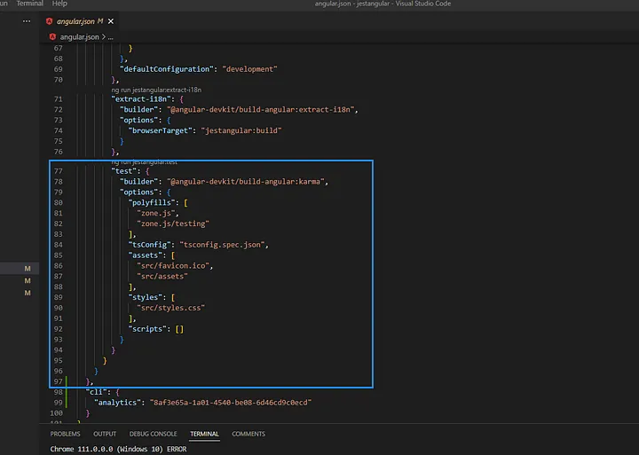

So, now that we are decided to use "Jest" for testing, how to set it up in our Angular project?

# STEP #1 - INSTALL PACKAGES

We need to install some packages using npm. 

We ofcourse need to install "jest" package.

Along with that, we need the "jest-preset-angular" package.

And finally, we need to install the "@types/jest" package which contains type definitions for "Jest".

We can install all three at once using this command -

    npm i jest jest-preset-angular @types/jest -D

Note that we are using "-D" flag which means we are installing these as "Dev" dependencies.

The next step is to make some changes to the scripts inside "package.json" file.

By default, in the package.json file of an Angular project, this is what the command for "test" is - 

    "test": "ng test"

The issue is that, even after we installed all the "jest" specific packages, if we run "npm run test", then it will not use jest. It will still use Jasmine + Karma. We do not want that. Hence, we can update this script to -

    "test" : "jest"

So now, when we say "npm run test", it will use "jest" to run the tests.

We can also create some other scripts -

    "test": "jest",
    "test:watch": "jest --watch",
    "test:ci": "jest --runInBand"

Here, the "test:watch" can be used to run jest in watch mode which means as we make changes to the files, it will automatically run the tests again.

As for the "--runInBand" flag, this one helps in an environment with limited resources. It will run all the tests one by one in the current process,  rather than in parallel. This is useful in resource-constrained environments like CI, where the overhead of worker processes is higher than the speedup of running tests in parallel.

# STEP #2 - UNINSTALL PACKAGES

Now that we have done this, we no longer require the "Karma" and "Jasmine" packages so we can remove all of them from package.json. For this, we can use this one command - 

    npm uninstall @types/jasmine jasmine-core karma karma-chrome-launcher karma-coverage karma-jasmine karma-jasmine-html-reporter

# STEP #3 - REMOVE THE TEST OBJECT FROM ANGULAR.JSON

There is still references to "Karma" in the angular.json file. Just go in that file and remove the entire "test" object from it.

# STEP #4 - SETUP-JEST FILE

Next up, create a new file named "setup-jest.ts" in the root and inside that, we just need one line of code which is - 

    import 'jest-preset-angular/setup-jest';

# STEP #5 - UPDATE TSCONFIG.SPEC.JSON FILE

Inside the tsconfig.spec.json file, you will see "jasime" in the array for "types" property. Remove it and in its place write - 

    "types": [
      "jest",
      "node"
    ]

# STEP #6 - JEST CONFIG FILE

We must create a new file in the root of our project named "jest.config.js".

As the name suggests, this file is where we will configure the jest framework for our Angular project. Inside it, we will add -

    module.exports = {
        preset: "jest-preset-angular",
        setupFilesAfterEnv: ["<rootDir>/setup-jest.ts"]
    }

So, we will mention what preset we will use and also we will specify our "setup-jest.ts" file for the property named "setupFilesAfterEnv". The "setupFilesAfterEnv" is executed after the test framework has been installed in the environment.

# AND WE ARE DONE

And we are done with the setup. 

Now, if you run the command "npm test", you will see that it shows -

    No tests found, exiting with code 1

And it makes sense because we have not written any tests yest. But, this means that jest is now configured properly and we can use it to write and run tests.

You will also see the count of files that it checked in the project and it also shows what all files it checked.

    testMatch: **/__tests__/**/*.[jt]s?(x), **/?(*.)+(spec|test).[tj]s?(x) - 0 matches
    testPathIgnorePatterns: \\node_modules\\ - 24 matches

This means it checks the files that are present in "__test__" folder or just files that end with "spec.ts" or "test.ts" or "spec.js" or "test.js". 

Jest will ignore the node modules folder.

