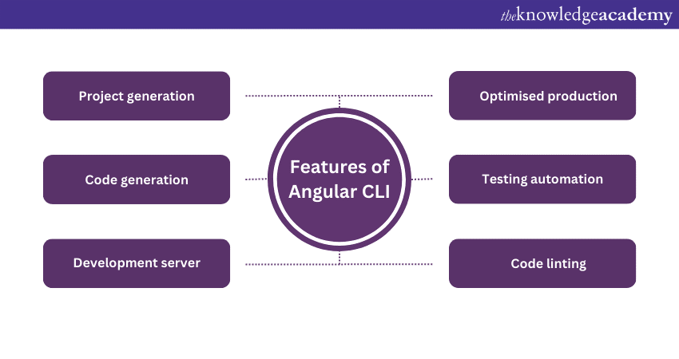

The Angular CLI is a command-line interface tool which allows you to scaffold, develop, test, deploy, and maintain Angular applications directly from a command shell.

If you open any Angular project's package.json file, there will be one dependency named "@angular/cli" in that file. This is the package that provides us access to the Angular CLI and this includes a binary named "ng". So, the commands that are invoked using "ng" use the Angular CLI.

For example, when you write "ng new" to generate a new project, it will us the Angular CLI for that.

One thing you can do when writing the commands in the terminal is to add the "--help" flag after them to know about what all arguments they can take and what other options we can pass to those commands.

    ng new --help

So, you will see a lot of flags that you can use with this command such as --prefix, --create-application, --force, and so on. The "--help" flag also lets us get a description of all the different options that we can pass, what is the data type, what is the default value and so on.

So, let's create a new project using ng new

    ng new angular-config