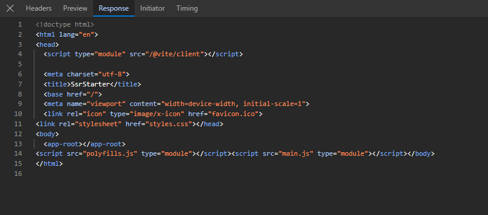
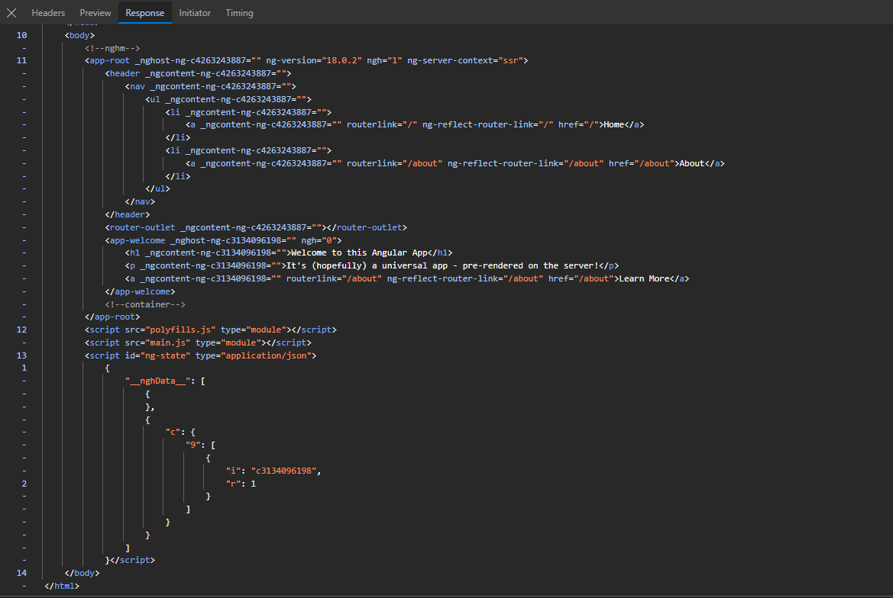

Before Angular 17, there was "Angular Universal". So, if you are still using Angular 16 or earlier, then you can add the "Angular Universal" functionality to an existing app by running - 

    ng add @nguniversal/express-engine

But, starting with Angular 17, the command will be - 

    ng add @angular/ssr

Moreover, if you are starting fresh, then you can tell the CLI to create an Angular Project with SSR enabled by default by writing -

    ng new <project-name> --ssr

And even if you miss the flag "--ssr", Angular CLI will ask you if you want to enable SSR or not.

Since our project uses Angular 18, we just need to run this command to add ssr functionality - 

    ng add @angular/ssr

It will now ask if you want to proceed with installing the package "@angular/ssr". Enter "Y" and proceed.

Now, once the process ends, you will see that some new files are created by Angular CLI and some are updated. Let's see what all was done.

# 1. server.ts

This is the main entry point for server-side rendering in an Angular application. It is responsible for configuring and starting the server-side rendering process.

Let's take a look at the dependencies that this file imports - 

    import { APP_BASE_HREF } from '@angular/common';
    import { CommonEngine } from '@angular/ssr';
    import express from 'express';
    import { fileURLToPath } from 'node:url';
    import { dirname, join, resolve } from 'node:path';
    import bootstrap from './src/main.server';

The "APP_BASE_HREF" is used to provide the base URL for the application.

"CommonEngine" provides a common engine to use to server render an application.

"express" is a Node.js framework and is a layer that is built on top of Node.js that heps manage servers and routes.

Other imports are just for routing purposes to make sure the paths are correct.

If you have worked with "Express.js", you will find the code in this file quite familiar. The file exports a function named "app" which creates an instance of the Express server. It then sets things such as the "view engine", the "views".

Finally, the most important lines are the "server.get" methods which are used to define what to do when the user visits some route in the browser.

The first server.get() is used to serve the static files from the /browser directory inside "dist" folder. This "dist" folder is generated when we run "ng build".

The second server.get() is for all the regular routes so that they all use the Common Engine.

# 2. main.server.ts 

    const bootstrap = () => bootstrapApplication(AppComponent, config);

    export default bootstrap;

This file exports one method named "bootstrap" that will bootstrap an instance of an Angular application and renders a standalone component as the application's root component. As we can see, the component passed to it is the "AppComponent".

This method is then imported inside "server.ts" file and it is used when we want the Angular engine to be used, hence you will find this being used in the second "server.get" method.

# 3. app.config.server.ts

    providers: [
        provideServerRendering()
    ]

This config file is used to define configuration information for the application. And as the name suggests, this one is specifically for server config. The only thing done in this file is to add a provider named "provideServerRendering()" which, if you hover over its name, says that it Sets up providers necessary to enable server rendering functionality for the application.

    export const config = mergeApplicationConfig(appConfig, serverConfig);

Then, this file exports both the "serverConfig" as well as the "appConfig" which is present in app.config.ts file.

# 4. angular.json

Now, let's talk about the files that are updated after we run the command to add SSR to our project. First is the "angular.json" file. 

We see that inside "build" property's "options", it added these lines - 

    "server": "src/main.server.ts",
    "prerender": true,
    "ssr": {
        "entry": "server.ts"
    }

This defines the entry point of server-side rendering in our Angular project and other things such as pre-rendering of pages.

# 5. tsconfig.app.json

Inside the "tsconfig.app.json", the "files" property is updated to add the "main.ts" and "main.server.ts" files.

    "files": [
        "src/main.ts",
        "src/main.server.ts",
        "server.ts"
    ],

And inside "types", it adds - 

    "types": [
      "node"
    ]

# 6. package.json

Then ofcourse in the package.json file, the dependencies for the "express" and "@angular/ssr" are added.

# 7. app.config.ts

Inside the app.config.ts, one provider is added named "provideClientHydration()". 

This sets up providers necessary to enable hydration functionality for the application. By default, the function enables the recommended set of features for the optimal performance for most of the applications

# RUNNING THE APPLICATION

Finally, to run the application after we added "ssr" functionality, just run "ng serve".

How can we verify that ssr is working for the initial page?

Well, the initial HTML request should contain application content.

If you open the network tab and reload the page, you will see one "localhost" request which returns an "html" page.

This is how the response looks like for the application that does not use ssr - 

And this is how it looks like for an application that uses ssr - 

So, the content of the website can be seen in the response that we get when we add ssr. 

And that's how SSR works for this initial page. All the scripts and all will be downloaded in the background but we will still see the static content on the page, and this is important when we talk about SEO and user experience.

