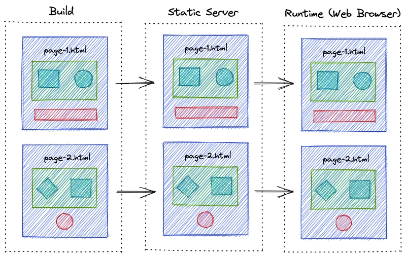

In this section, we discussed three types of rendering methods.

    - Client Side Rendering (CSR)
    - Server Side Rendering (SSR)
    - Static Site Generation (SSG)
  
The most commonly used rendering method is CSR. However, it has its own disadvantages. So, we can use SSR or SSG to overcome those disadvantages.

So, let's understand what is the difference between these three rendering methods.

**1. CLIENT SIDE RENDERING (CSR)**

This is basically the technique where the server sends the client an almost empty HTML file and then JavaScript handles all the rendering in the browser (client-side). Frameworks like Angular and React use CSR by default.

The server sends a blank HTML file and the JavaScript code is responsible for rendering the content. The browser downloads the JavaScript code and executes it to render the content. This means that the server does not have to do any work to render the content, which can be a performance advantage.

This is great for data that changes often and you do not care about SEO that much. 

**2. SERVER SIDE RENDERING (SSR)**

In this approach, the server generates the HTML content on the server before it delivers it to the client. This approach enables search engines to index content effectively, resulting in improved SEO and faster initial page loads.

When a user requests a page, the server fetches the necessary data and generates the HTML content. The fully rendered page is then sent to the client. Despite the benefits, SSR can introduce challenges related to server load and complex data fetching.

**3. STATIC SITE GENERATION (SSG)**

In SSR, we render on each request. Why not generate those files in the built time itself so that we can instantly server the pages when user requests them?

That's exactly what SSG does. It generates the HTML files at build time and serves them to the client. This approach is ideal for content that does not change frequently, as it allows for fast loading times and improved SEO.

During the build phase, the application generates HTML files for each page. These static files are then served to users, minimizing the need for server-side rendering and database queries.

# WHICH ONES TO USE?

SSG is the best when you have a static website which almost never changes. Think about documentation, landing pages for a service, portfolios.

SSR is great if you have data that changes often and you want a good SEO rating, think maybe about a news website, but you will need to have a server which is capable of handling all the requests and rendering the page as fast as possible.

CSR is great if you have data that changes often but you don't care about good SEO rating. This is useful for web apps where there's a lot of logic involved, maybe a tool which doesn't need to show any info to search engines. It is also fine for apps that have their main content behind a login page, like a dashboard or a web app where the user needs to log in to see the content. In those cases, the search engine crawler will not be able to see the content anyway, so it doesn't matter if the page is rendered on the client or server.

