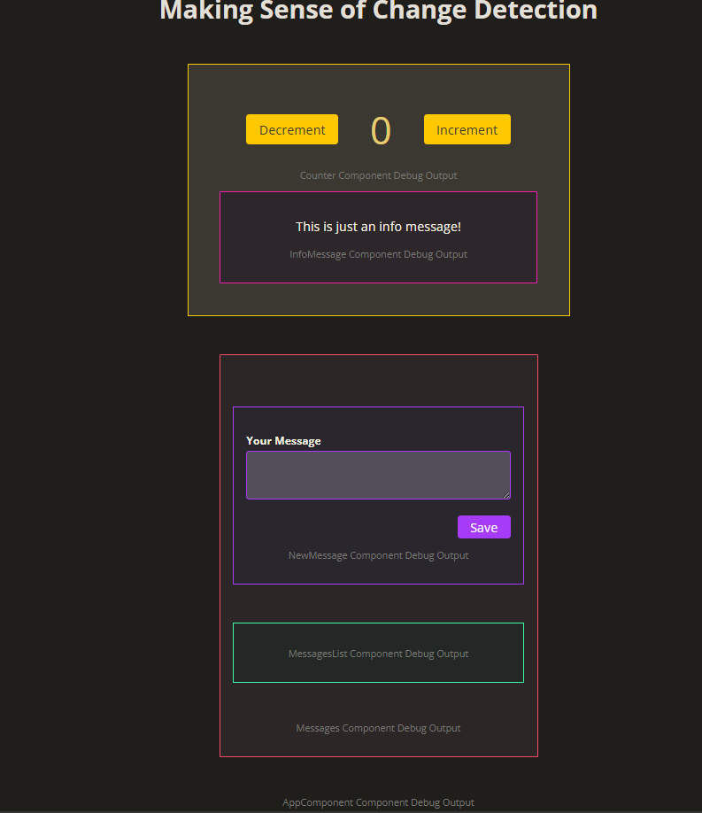
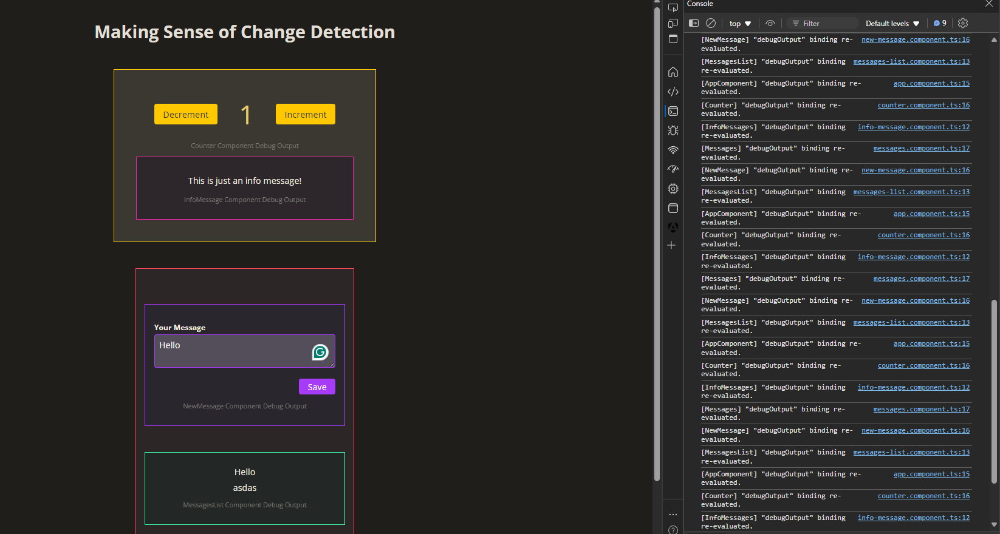

You'll find this simple Angular project in this section where we have a counter with two buttons. One button will Increment the value and the other will decrement.

If you check the "counter" folder, then it has a "counter" component which has the code for this entire component that you see with a Yellow Border.

    

    <button (click)="onDecrement()">Decrement</button>
    {{ count() }}
    <button (click)="onIncrement()">Increment</button>
    

    
{{ debugOutput }}

    <app-info-message />

You will also see we are rendering another component inside this "counter" component. This is the "InfoMessage" component. This component is simply this - 

    
This is just an info message!

    
{{ debugOutput }}

When we click on the paragraph, it simply logs a text to console -

    onLog() {
        console.log('Clicked!');
    }

Then, we have the second portion of this application with a "Red" border and this is what the "MessagesComponent" has. This component is like this -

    <app-new-message (add)="onAddMessage($event)" />
    <app-messages-list [messages]="messages()" />

    
{{ debugOutput }}

It is rendering two other components inside it. One is the "NewMessage" component with a "Purple" border and the other is the "MessageList" component with a "Green" border.

This is the template of "NewMessage" component - 

    <form (ngSubmit)="onSubmit()">
    

        <label for="message">Your Message</label>
        <textarea id="message" name="message" [(ngModel)]="enteredText"></textarea>
    

    

        <button>Save</button>
    

    </form>

    
{{ debugOutput }}

We simply have a form with one textarea and one "Save" button. When the form is submitted, we call the "onSubmit()" method that is like this -

    add = output<string>();
    enteredText = signal('');

    onSubmit() {
        this.add.emit(this.enteredText());
        this.enteredText.set('');
    }

So, we simply emit the entered text and then reset the text area.

This emitted event named "add" is then handled inside the "MessagesComponent" -

    <app-new-message (add)="onAddMessage($event)" />

This is the template of "MessagesComponent" -

    messages = signal<string[]>([]);

    onAddMessage(message: string) {
        this.messages.update((oldMessages) => [...oldMessages, message]);
    }

So, we simply update an array of messages whenever we save a new message. So, as you keep saving new messages, you will see the output in the "Green" bordered component which is the message list component.

This is the template of Message List component - 

    <ul>
    @for (message of messages(); track message) {
        <li>{{ message }}</li>
    }
    </ul>

    
{{ debugOutput }}

It simply accepts as an input a list of messages and then renders them in the template.

And finally, the component that wraps all of the above components inside it is the "AppComponent". This is the template of AppComponent - 

    <h1>Making Sense of Change Detection</h1>

    <app-counter />
    <app-messages />

    
{{ debugOutput }}

You will see that every component has this paragraph with "debug-output" class. And for each component, the "debugOutput" is a getter defined something like this -

    get debugOutput() {
        console.log('[AppComponent] "debugOutput" binding re-evaluated.');
        return 'AppComponent Component Debug Output';
    }

So, it first outputs some text to the console and then returns a text that is rendered on the browser.

This is the whole project.

Since we have console log statements written all over the place, if you open the console, you will see lots and lots of console log statements printed as you interact with various elements in the application.

These console log statements will help up see which component is being re-evaluated by Angular's Change Detection Mechanism.