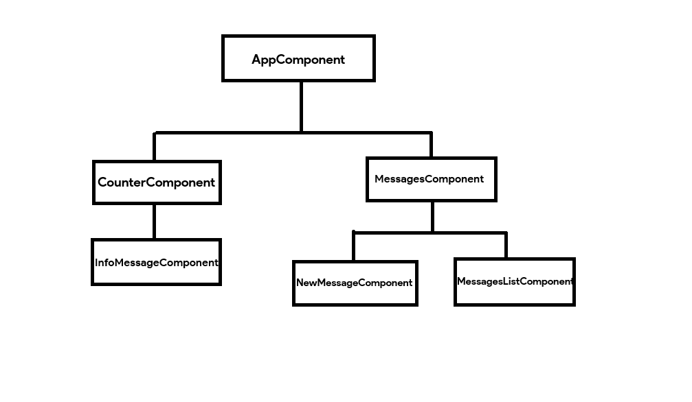
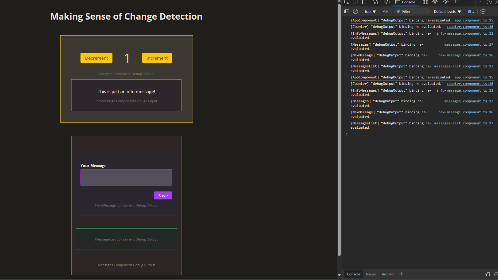

# COMPONENT TREE

Before we start with Change Detection, we need to understand the concept of "Component Tree" in Angular.

The Component Tree in Angular represents the hierarchical structure of components in an Angular application. It visualizes how components relate to each other, starting from the root component (AppComponent) down to its child components, and their children, forming a tree-like structure.

Angular applications are composed of components, where each component can have child components. The root component is the entry point (usually AppComponent), and all other components are nested within it.

Each component in the tree is an independent instance with its own logic, template, and state.

For example, in our project, we have this structure - 

    AppComponent
    |
    | -- CounterComponent
         | -- InfoMessageComponent
    | -- MessagesComponent
         | -- NewMessageComponent
         | -- MessagesListComponent

If we have to create the component tree, it would look something like this -

Angular always starts rendering from the "Root" component (AppComponent). Then, it recursively renders the child components as defined in the templates.

In each change detection cycle, Angular will traverse this Component Tree. Each component is checked for changes, starting from the root and propagating downward.

# ZONE JS

So, how does Angular performs Change Detection? 

After the introduction to "Signals", it is better to frame this question as - "How did Angular use to do Change Detection?".

Well, Angular would use a library named "Zone.js".

Zone.js is a key library used by Angular to handle asynchronous operations and enable its powerful change detection mechanism. Without Zone.js, Angular wouldn’t know when to trigger change detection because JavaScript operates in an event-driven, non-blocking manner where asynchronous tasks like API calls, timers, or user interactions are decoupled from the application logic.

Zone.js creates an "execution context", known as a "Zone" that wraps around async tasks like "setTimeout", "Promise" or "DOM Events". And it keeps track of when such tasks as initiated and completed.

So, Whenever an asynchronous operation completes, Zone.js notifies Angular to run its change detection cycle. This ensures the application's UI stays in sync with its data model without manual intervention.

When an Application starts, it creates a root zone named "NgZone" that wraps the entire application.

For example, if we have a component with this code - 

    message = 'Hello, World!';

    updateMessage() {
        setTimeout(() => {
        this.message = 'Hello, Angular!';
        }, 1000);
    }

And this is the template - 

    
{{ message }}

    <button (click)="updateMessage()">Update Message</button>
  
When we click the button, then after "1" second the message will change. So, how does Angular know after 1 second that message changed so it should re-revaluate the component?

That's where "Zone.js" comes into the picture.

This is what happens - 

    1. setTimeout is called.
    2. Zone.js intercepts setTimeout and registers the task.
    3. When timer expires, Zone.js will detect that the task is complete and it notifes Angular to trigger Change Detection.
    4. Angular updates the DOM to display the new message.

So, thanks to "Zone.js", we don’t have to manually trigger change detection after asynchronous tasks (e.g., updating the DOM after API calls).

Zone.js also integrates well with JavaScript's async APIs and ensures Angular remains reactive.

Moreover, Developers can use custom zones to fine-tune performance by controlling which tasks trigger change detection.

# WHEN DOES CHANGE DETECTION GETS TRIGGERED AUTOMATICALLY?

The Angular's Change Detection will get triggered automatically in these scenarios -

1. **USER INTERACTIONS** - Events such as clicks, input typing, and form submissions automatically trigger change detection.

For example, if we have - 

    <button (click)="updateData()">Click Me</button>

When the button is clicked, Angular runs change detection to update the view if "updateData()" modifies any bound property.

2. **ASYNCHRONOUS OPERATIONS** - Any async task tracked by Zone.js triggers change detection. For example setTimeout, setInterval, HTTP requests using HttpClient, Promises or async/await and so on.

3. **TEMPLATE BINDING EVALUATIONS** - Angular automatically checks for changes to bound properties in templates during change detection cycles. For example - 

        
{{ title }}

If title changes in the component, Angular updates the DOM.

4. **OBSERVABLE EMISSIONS** - When an observable emits a value (e.g., using RxJS), and the result is bound in the template, Angular triggers change detection. For example - 
   
        this.data$.subscribe(value => {
            this.data = value; 
        });

In this case, Angular runs change detection after updating 'data'.

5. **BROWSER EVENTS** - DOM events like keyup, change, mouseenter, etc., trigger change detection automatically.

6. **COMPONENT LIFECYCLE HOOKS** - Hooks like "ngOnInit", "ngDoCheck", and "ngOnDestroy" automatically involve change detection to update the view.

# UNDERSTANDING CHANGE DETECTION IN OUR PROJECT

In our current project, let's clear the console, and just do one thing. We will simply click the "Increment" button. Now notice the console. It will print something like this -

So, even though we just clicked the "Increment" button that is present inside the "CounterComponent", it printed the "debugOutput" inside every single component in our application. And from the order of console log statements in the browser, you can understand how Angular is traversing the component tree.

    [AppComponent] "debugOutput" binding re-evaluated.
    [Counter] "debugOutput" binding re-evaluated.
    [InfoMessages] "debugOutput" binding re-evaluated.
    [Messages] "debugOutput" binding re-evaluated.
    [NewMessage] "debugOutput" binding re-evaluated.
    [MessagesList] "debugOutput" binding re-evaluated.
    [AppComponent] "debugOutput" binding re-evaluated.
    [Counter] "debugOutput" binding re-evaluated.
    [InfoMessages] "debugOutput" binding re-evaluated.
    [Messages] "debugOutput" binding re-evaluated.
    [NewMessage] "debugOutput" binding re-evaluated.
    [MessagesList] "debugOutput" binding re-evaluated.

This is how it re-evaluated - 

    AppComponent -> CounterComponent -> InfoMessagesComponent -> MessagesComponent -> NewMessageComponent -> MessageListComponent 
    -> AppComponent -> CounterComponent -> InfoMessagesComponent -> MessagesComponent -> NewMessageComponent -> MessageListComponent

Wait a minute! Why is it traversing the tree twice? Beacuse it is not efficient right?

Well, this happens only in "Development" mode.

In development mode, Angular runs change detection twice to check if the value has changed since the first run. In production mode, change detection is only run once for better performance.

So, you can consider Angular to traverse the tree simply like this -
    
    AppComponent -> CounterComponent -> InfoMessagesComponent -> MessagesComponent -> NewMessageComponent -> MessageListComponent 

Basically, we can see that even though button was clicked in "CounterComponent", Angular re-revaluated every single component, starting form the Root Component.

When we clicked "Increment" button, it updated the "counter" property's value which is also being used in the template and this triggered a Change Detection Cycle which then traversed the entire tree to update all the components that need updation.

It is important to note that if we did not have any event listener for this button -

    <button>Increment</button>>

Then even if we clicked it, nothing would've printed in the console because Change Detection would not run in that case.

So, only if we have an event listener to listen to that DOM event, then only Change Detection Cycle will run.