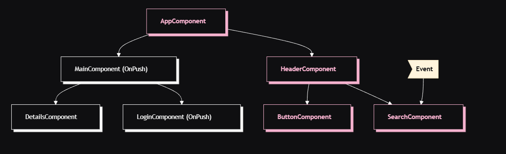
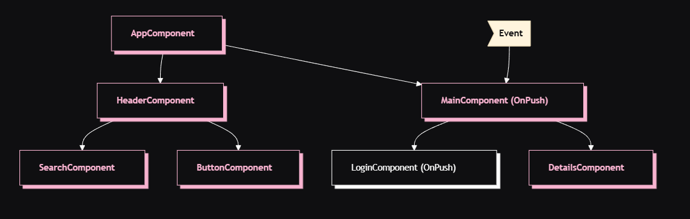
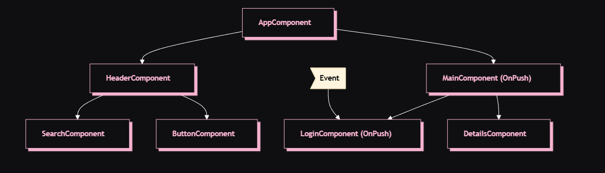
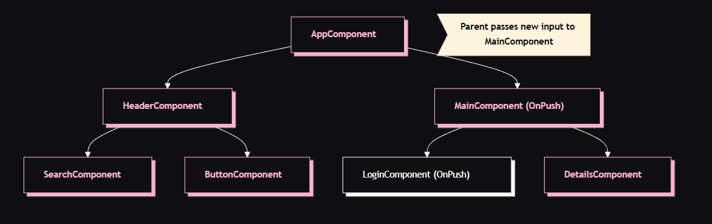

So far, we have understood how to write efficient template bindings and to run some piece of code outside the Zone so that Change Detection does not get triggered.

But there is still one issue. Whenever something changes in one component, Angular will run Change Detection that checks every single component in our Component Tree, even if that component is unaffected by that change.

This is the "Default" Change Detection Strategy in Angular.

Besides this, Angular also has the "OnPush" change detection strategy.

The "OnPush" change detection strategy is a feature in Angular that optimizes the change detection process by reducing the number of checks and updates made by Angular's change detection mechanism. It is designed to improve the performance of your Angular applications by focusing on components that explicitly indicate when their input properties have changed.

By default, Angular uses the "Default" change detection strategy, where it checks for changes in all components and their templates on every change detection cycle. This can lead to unnecessary checks and updates, impacting performance in larger applications. The "OnPush" strategy provides a way to mitigate this by making components more selective about when they should be checked for changes.

For example, in our project, in the "MessagesComponent", we can use this "OnPush" strategy using the "changeDetection" property of @Component decorator - 

    @Component({
        changeDetection: ChangeDetectionStrategy.OnPush
    })

Now, if you run the application again, then initially, all the components will be re-evaluated and hence you see all the logs in the console.

But now, click the "Increment" or "Decrement" button for the counter and see the console.

You will notice that this time, the output is this - 

    [AppComponent] "debugOutput" binding re-evaluated.
    [Counter] "debugOutput" binding re-evaluated.
    [InfoMessages] "debugOutput" binding re-evaluated.
    [AppComponent] "debugOutput" binding re-evaluated.
    [Counter] "debugOutput" binding re-evaluated.
    [InfoMessages] "debugOutput" binding re-evaluated.

So now, the "MessagesComponent" and its child components are skipped by Angular's Change Detection entirely.

This is very important to understand. Using "OnPush" on MessagesComponent does not mean that its children will not get affected by this stratgy. The entire "Subtree" will get affected which has parent as the "MessagesComponent".

# HOW DOES ONPUSH STRATEGY WORKS?

So, what exactly happens when we enable the "OnPush" strategy?

When we set the change detection strategy for a specific component to "OnPush", Angular optimizes change detection for that component tree by restricting it to certain scenarios. This ensures that Angular will only check the component and its children in specific cases.

So, what are these specific cases?

1. **INPUT CHANGES**

Angular will check the component only when one of its "@Input" properties receives a new value. Note that ANgular only checks the "references" by default. The change detection will only trigger if the reference of the input value changes (i.e., new object or array) due to Angular's reliance on reference checks.

2. **EVENT BINDING**

Change detection is triggered when an event bound in the component is fired (e.g., a button click or input change). 

Note that this event handling can be in the subtree's root component or any of its children (whether they are using OnPush change detection or not).

3. **ASYNC PIPE UPDATES**

Data updates via asynchronous operations (e.g., observables or promises resolved using the async pipe) will also trigger change detection.

# EXAMPLE

Let's see some examples to understand how this "OnPush" strategy will affect the Change Detection. These are from the official Angular documentation.

## 1. An event is handled by a component with default change detection

If Angular handles an event within a component without "OnPush" strategy, the framework executes change detection on the entire component tree. Angular will skip descendant component subtrees with roots using OnPush, which have not received new inputs.

If we set the change detection strategy of "MainComponent" to "OnPush" and the user interacts with a component outside the subtree with root "MainComponent", Angular will check all the pink components from the diagram above (AppComponent, HeaderComponent, SearchComponent, ButtonComponent) unless "MainComponent" receives new inputs.

## 2. An event is handled by a component with OnPush change detection

If Angular handles an event within a component with OnPush strategy, the framework will execute change detection within the entire component tree. Angular will ignore component subtrees with roots using OnPush, which have not received new inputs and are outside the component which handled the event.

As an example, if Angular handles an event within "MainComponent", the framework will run change detection in the entire component tree. Angular will ignore the subtree with root "LoginComponent" because it has "OnPush" and the event happened outside of its scope.

## 3. An event is handled by a descendant of a component with OnPush

If Angular handles an event in a component with "OnPush", the framework will execute change detection in the entire component tree, including the component’s ancestors.

As an example, in the diagram above, Angular handles an event in LoginComponent which uses OnPush. Angular will invoke change detection in the entire component subtree including MainComponent (LoginComponent’s parent), even though "MainComponent" has "OnPush" as well. Angular checks "MainComponent" as well because "LoginComponent" is part of its view.

## 4. New inputs to component with OnPush

Angular will run change detection within a child component with "OnPush" when setting an input property as result of a template binding.

For example, in the diagram above, "AppComponent" passes a new input to "MainComponent", which has "OnPush". Angular will run change detection in "MainComponent" but will not run change detection in "LoginComponent", which also has "OnPush", unless it receives new inputs as well.

# EDGE CASES

There are some cases where Angular will not run Change Detection Manually.

In case an input receives a mutable object as value and you modify the object but preserve the reference, Angular will not invoke change detection. That’s the expected behavior because the previous and the current value of the input point to the same reference.

When you use an API like "@ViewChild" or "@ContentChild" to get a reference to a component in TypeScript and manually modify an "@Input" property, Angular will not automatically run change detection for "OnPush" components. 

If you need Angular to run change detection, you can inject "ChangeDetectorRef" in your component and call "changeDetectorRef.markForCheck()" to tell Angular to schedule a change detection.

# EXAMPLE

Let's say we want to use OnPush somewhere else in our app.

In our current project, if you type something in the New Message form, you will see in the console that it runs a Change Detection cycle that also checks the Counter component and its children, even though they are unaffected with any change in New Message Component.

So, how to avoid this unnecessary checking? Well, we can use "OnPush" on the "Counter" component. Note that we use "OnPush" on the component subtree on which we do not want Angular to run unnecessary checks when something changes somewhere else that does not affect that component.

    @Component({
        selector: 'app-counter',
        standalone: true,
        templateUrl: './counter.component.html',
        styleUrl: './counter.component.css',
        imports: [InfoMessageComponent],
        changeDetection: ChangeDetectionStrategy.OnPush <- HERE
    })

And now, even if we add a new message or enter something in the text box, it will not re-revaluate the Counter component or any of its children because we told Angular not to do that.

And we can take it one step further.

The "InfoMessage" component is a child of "Counter" component but changing of counter has no affect on this "InfoMessage" component so it makes no sense to run Change Detection on this component even if something changes in "Counter Component". So, we can add "OnPush" strategy to this "InfoMessage" component as well - 

    @Component({
        selector: 'app-info-message',
        standalone: true,
        imports: [],
        templateUrl: './info-message.component.html',
        styleUrl: './info-message.component.css',
        changeDetection: ChangeDetectionStrategy.OnPush <- HERE
    })

So now, even though the "InfoMessage" component is a Child Component of "Counter", Angular will not re-evaluate it because this "InfoMessage" component itself is using "OnPush". So, the component subtree with root as "InfoMessage" component will not be checked unless some input changes in this tree or some event happens, none of which happens in our case.

Another place where we can use "OnPush" is the "MessagesList" component because right now, even if we type something in the text box of "NewMessageComponent", Angular re-evaluates the "MessagesList" component too. We just want it to re-evalute it only when its input changes, that is, when some new message gets added to the list of messages.

    @Component({
        selector: 'app-messages-list',
        standalone: true,
        templateUrl: './messages-list.component.html',
        styleUrl: './messages-list.component.css',
        changeDetection: ChangeDetectionStrategy.OnPush <- HERE
    })

And now, our application is more efficient than before because there are no unnecessary evaluations.